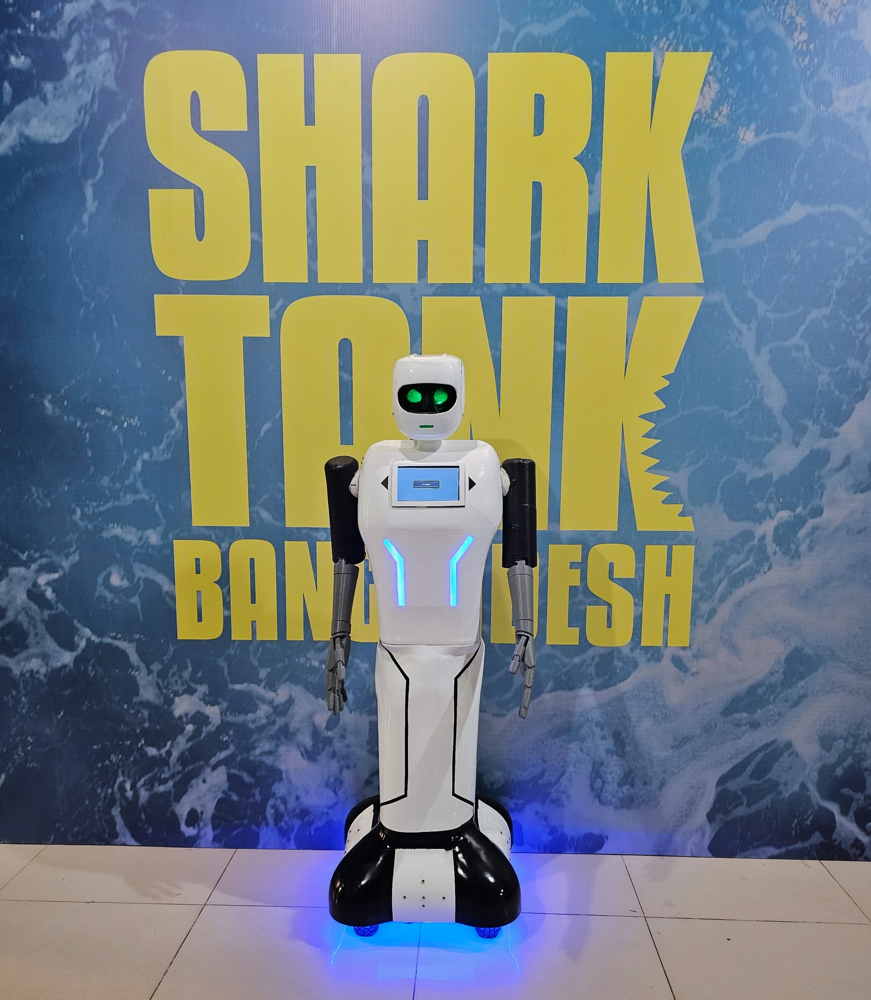
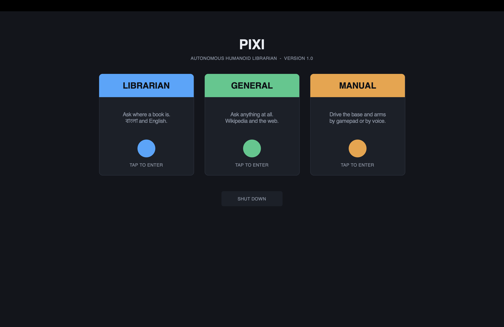
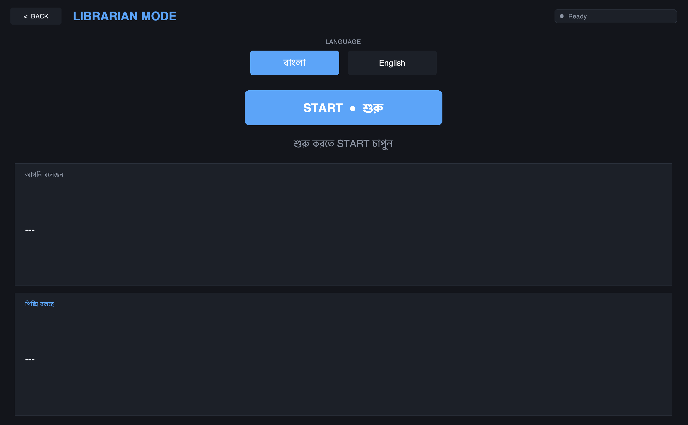
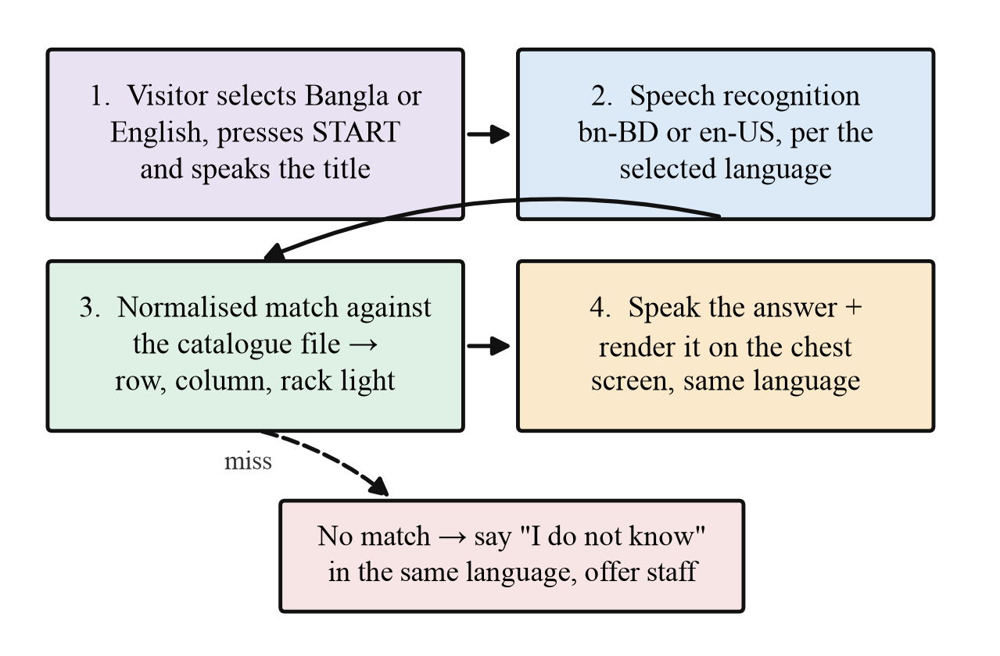
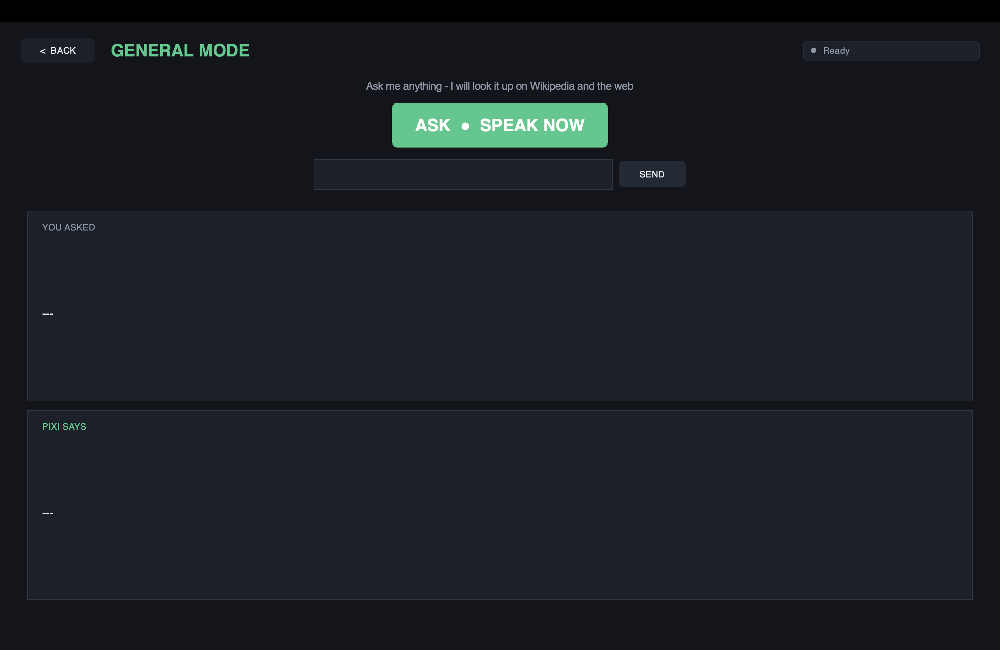
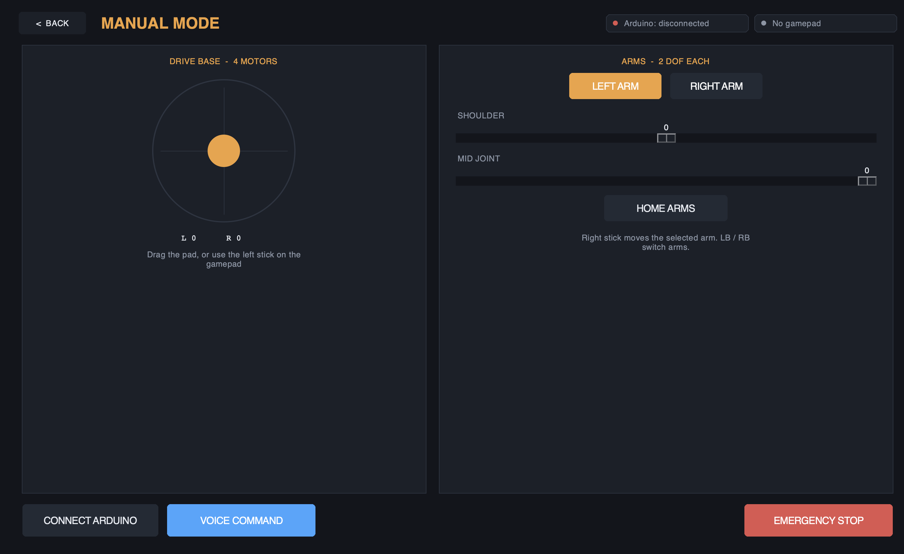
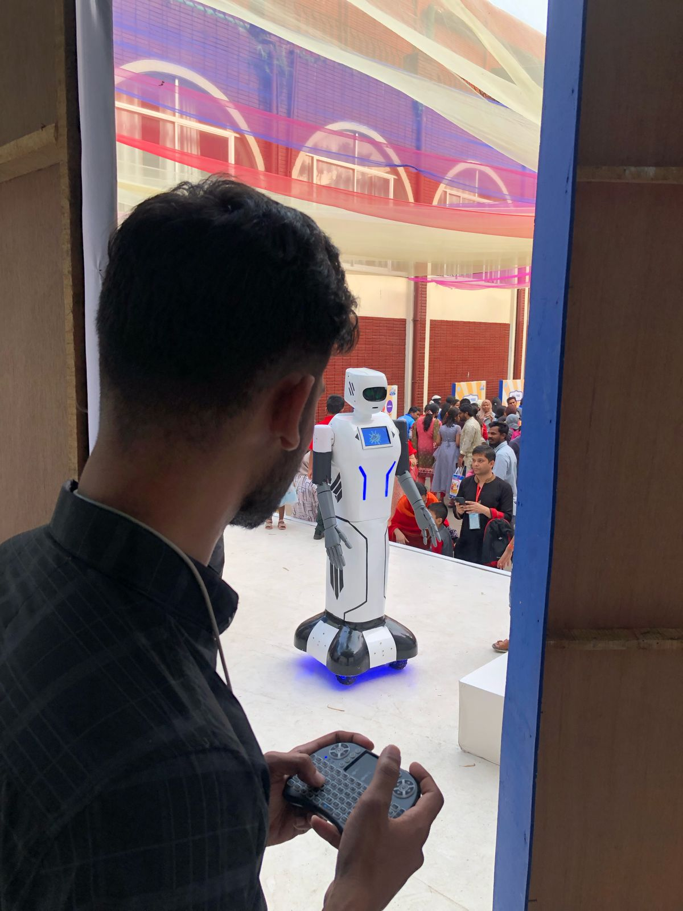
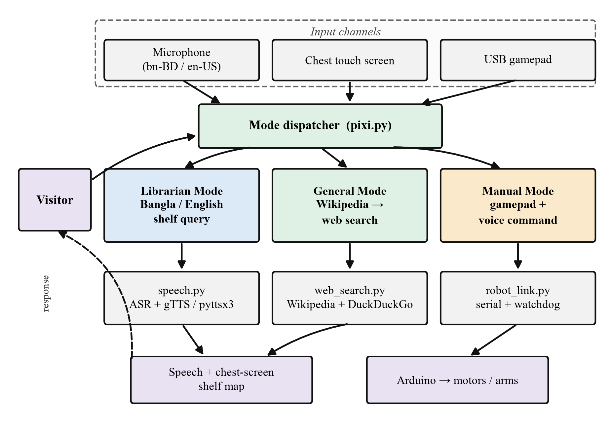
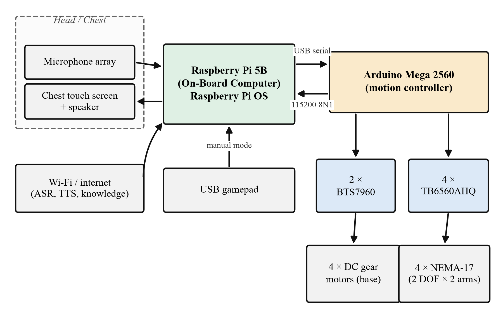
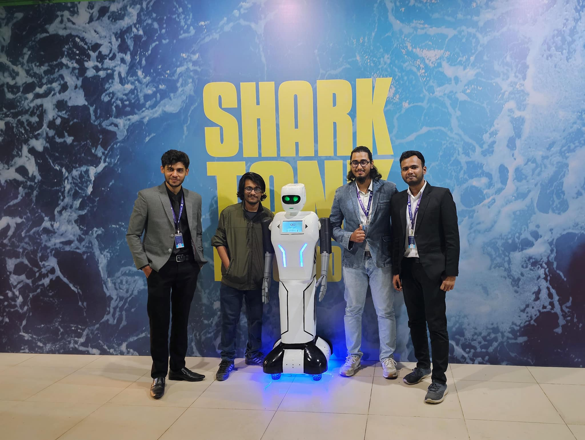

<div align="center">

# 🤖 Pixi — A Bilingual Humanoid Librarian Robot

### Shelf-level book guidance in **বাংলা** and **English**, for a public district library

*Built at Roboway Labs, Dhaka · Deployed at the District Councillor's Office Library, Cumilla, Bangladesh*

[](https://www.python.org/)
[](https://www.raspberrypi.com/)
[](https://www.arduino.cc/)
[](https://docs.python.org/3/library/tkinter.html)


<br/>



<sub><b>Pixi Version 2.0</b> — a 55-inch, ~15 kg wheeled humanoid. The chest-mounted<br/>touch screen carries the visual half of every answer the robot gives.</sub>

</div>

---

## 🎬 See it working

<div align="center">

[](https://youtube.com/shorts/AEy8oudIucM?si=E_RUsApSXo68ur9F)

**▶ [Watch Pixi in action](https://youtube.com/shorts/AEy8oudIucM?si=E_RUsApSXo68ur9F)**

</div>

---

## The problem this solves

A public library in a Bangladeshi district town runs on institutional memory. Shelves are numbered, but the numbering rarely survives reorganisation. Catalogues exist — often as a ledger rather than a database. And the mapping from a title a visitor half-remembers to a physical location on a rack lives, in practice, inside the head of whoever has worked there longest. **When that person is busy, the queue simply waits.**

At the District Councillor's Office Library in Cumilla, nearly every question arrives in Bangla. Most of those questions are not hard — they are the same handful of enquiries repeated many times a day, consuming staff attention that could go to the genuinely difficult requests.

Pixi absorbs that first, repetitive layer of enquiry:

> A visitor selects **বাংলা** or **English**, presses one button, and speaks the title.
> Pixi matches it against the shelf catalogue and answers **twice over** — aloud in the
> language of the question, and visually on its chest screen, naming the **row**, the
> **column**, and the rack indicator to follow.

The redundancy is deliberate. A spoken *"shelf two, column three"* is easy to mishear across a room and easily forgotten during the walk to the rack. Text persists, and can be re-read.

---

## ✨ Three modes, one robot

<div align="center">


<sub><b>The control panel.</b> All three modes are presented as equal entry points rather than<br/>burying two of them in a menu. Designed for the chest touch screen, so every target is finger-sized.</sub>
</div>

<br/>

### 📚 Librarian Mode — bilingual shelf guidance

<div align="center">


<sub><b>Librarian Mode with বাংলা selected.</b> The language toggle is a <i>first-class control</i>, not an inferred<br/>property of the utterance — one press commits speech recognition, catalogue matching, synthesis<br/>and on-screen text to the same language together.</sub>
</div>

Why an explicit toggle rather than automatic language detection? Code-switching is pervasive in Bangladeshi speech, book titles are frequently English words spoken with Bangla phonology, and a misidentified language corrupts recognition, matching **and** synthesis all at once. A visible toggle costs one press and removes an entire class of failure.

The catalogue is a plain key–value file — one per language — that **library staff maintain themselves, without touching code**. This was a requirement, not a convenience: a system that needs an engineer to add a book will not survive its first month.

A miss produces an explicit *"I do not know"* in the visitor's language rather than a guess. For an information service, that is the safer failure.

<div align="center">


<sub><b>The Librarian Mode interaction loop</b> — deliberately short, four steps from button press to spoken<br/>and on-screen answer, with an honest failure path when the catalogue has no match.</sub>
</div>

<br/>

### 🌐 General Mode — open questions

<div align="center">


<sub><b>General Mode.</b> Answers open questions through a small conversational table, the clock, a Wikipedia<br/>summary, then a web search. The typed input box beside the microphone exists because a busy<br/>reading hall defeats far better microphones than ours.</sub>
</div>

<br/>

### 🎮 Manual Mode — teleoperation

<div align="center">


<sub><b>Manual Mode.</b> Drive pad, per-joint arm sliders, live Arduino and gamepad link status, a voice-command<br/>button, and a hardware-backed emergency stop. Staff use this to park the robot, clear a doorway,<br/>or bring it to a visitor who cannot easily walk.</sub>
</div>

Three independent routes into the same motion stack:

| Input | Controls |
|---|---|
| USB gamepad — left stick | Forward / reverse / turn |
| USB gamepad — right stick | Shoulder and mid joint of the selected arm |
| `LB` / `RB` | Switch between left and right arm |
| `B` | Emergency stop |
| On-screen drag pad | Duplicates the left stick, for touch-only operation |
| Per-joint sliders | Move one joint to an exact angle |
| **Voice command** | `"go forward"`, `"turn left"`, `"stop"`, `"raise left arm"`, `"bend right elbow"`, `"wave"`, `"home"` |

The spoken vocabulary is deliberately small and phonetically well separated — it has to work in a room with echo and background conversation.

<div align="center">


<sub><b>Manual teleoperation at a public demonstration.</b> An operator drives Pixi from a handheld<br/>controller while the robot interacts with visitors.</sub>
</div>

---

## 🏗 System architecture

<div align="center">


<sub><b>One process, one serial link, three interchangeable modes</b> over a shared speech and knowledge layer.<br/>Earlier versions launched each capability as a separate process — with the awkward consequence that<br/>two of them could not hold the serial port at the same time.</sub>
</div>

Leaving a mode is an **event**, not merely a change of view: the frame being left is told to release whatever it holds, which for Manual Mode means stopping the motors before the operator can navigate away. Because all three modes share the same services, a language chosen in one place applies consistently, and there is exactly **one** object in the system that can command motion.

<div align="center">


<sub><b>Processing and control.</b> The Raspberry Pi 5B handles speech, knowledge and the interface;<br/>an Arduino Mega 2560 owns all motion timing. The Pi's only authority is to <i>state an intent</i> —<br/>a speed, an angle — which the controller is free to clamp or refuse.</sub>
</div>

That split is deliberate. The Pi runs a general-purpose operating system and is subject to scheduling jitter, garbage collection and network stalls. **None of those are acceptable in the loop that holds a 15 kg platform still.**

---

## 🔌 Hardware

| Subsystem | Specification |
|---|---|
| **Frame** | SolidWorks-designed, 3D printed in PLA. Upper + lower body, 55 in tall, ≈15 kg |
| **Base** | 4 × DC gear motors, two per side (tank drive) via 2 × BTS7960 |
| **Arms** | 2 arms × 2 DOF (shoulder + mid joint), 4 × NEMA-17 steppers via TB6560AHQ |
| **Arm drive** | Planetary gearbox, ≈5 kg payload per hand, limit-switch homing |
| **Compute** | Raspberry Pi 5B (Raspberry Pi OS) + Arduino Mega 2560 |
| **Link** | USB serial, 115200 8N1 |
| **Interaction** | Chest touch screen, speaker, microphone, camera, projector module |
| **Power** | 2 × 12 V lead-acid, relay-based cutoff, rails at 3.3 V / 5 V / 12 V / 12 V |

### Serial protocol

One ASCII command per line. The design is intentionally dull — human-readable commands can be typed by hand into a serial terminal during a fault, and a line-oriented format resynchronises naturally after corruption, which a binary framing does not.

| Command | Meaning | Reply |
|---|---|---|
| `P` | Ping / identify | `OK PIXI 1.0` |
| `D,<left>,<right>` | Drive, −255…255 per side | `OK` |
| `A,<L\|R>,<S\|M>,<deg>` | Move one arm joint to an absolute angle | `OK` |
| `H` | Home both arms against limit switches | `OK` |
| `S` | Stop base and arms | `OK` |
| *(unrecognised)* | — | `ERR` |

### 🛡 Safety, enforced in firmware

Both properties live on the **microcontroller**, not the Pi — because the Pi is the component most likely to fail.

- **Watchdog.** The controller stops the base by itself if no command arrives within **500 ms**. The panel transmits every 50 ms while a stick is held, so a crashed application, a severed cable, or an operator who walks away brings the robot to rest instead of running it into a shelf.
- **Double clamping.** Joint travel is clamped twice — once when the command is composed, again when it is parsed — so a corrupted serial line cannot fold an arm back into the robot's own body.

---

## 📊 Measured performance

Because the motion controller cannot be exercised without the robot physically present, the firmware's command parser was reimplemented against a pseudo-terminal, so the **complete host-side stack runs unmodified** against a controller that responds exactly as the sketch does.

| Component | Mean | Median | p95 / max |
|---|---|---|---|
| Controller round trip | 0.013 ms | 0.010 ms | 0.027 / 0.073 ms |
| Catalogue lookup (Bangla) | 0.0025 ms | — | — |
| Catalogue lookup (English) | 0.0023 ms | — | — |
| General knowledge query | 1184 ms | 1025 ms | — |
| Bangla speech synthesis | 561 ms | 477 ms | — |
| UART wire time *(analytic)* | ≈1.3 ms | — | — |

- **11 / 11** controller protocol conformance checks pass, including both clamping paths and all malformed-input cases
- **≈57,000** commands/s sustained through the software path — against a control loop that needs 20
- **50 / 50** in-vocabulary voice commands resolved; **all** out-of-vocabulary input rejected rather than guessed

> The UART figure is **analytic**, derived from 15 bytes at 115200 8N1 — not measured on hardware. Everything else in the table is measured and reproducible from this repository.

---

## 🚀 Running it

```bash
git clone https://github.com/ArifinRafi/Pixi_Librarian_Version1.0.git
cd Pixi_Librarian_Version1.0

python3 -m venv .venv
.venv/bin/pip install -r requirements.txt
.venv/bin/python pixi.py
```

`F11` toggles full screen · `Escape` returns to the mode selector.

The serial port defaults to `/dev/ttyACM0` on the Pi and `COM3` on Windows. Override it without editing anything:

```bash
PIXI_SERIAL_PORT=/dev/ttyUSB0 .venv/bin/python pixi.py
```

**With no Arduino attached the panel still runs** — Manual Mode reports *Arduino: disconnected* and drops the commands. That is how the interface gets developed at a desk.

<details>
<summary><b>Platform notes</b> (click to expand)</summary>

<br/>

**Raspberry Pi / Debian**

```bash
sudo apt install python3-tk python3-pyaudio portaudio19-dev \
                 espeak flac mpg123 fonts-noto-core
```

`fonts-noto-core` matters — without a Bengali-capable font the Bangla interface renders as empty boxes.

**macOS**

```bash
brew install portaudio
```

Also check which Tk your Python is linked against. Apple still ships Tcl/Tk 8.5.9 from 2010 in `/usr/lib`, and pyenv builds against it by default. Tk 8.5 lays the window out correctly on modern macOS but **paints nothing at all** — you get an empty window and no error. `pixi.py` prints a warning if it detects this.

```bash
brew install python-tk@3.12
/opt/homebrew/bin/python3.12 -m venv .venv
```

**Arduino** — the sketch in `arduino/pixi_controller/` requires the **AccelStepper** library.

</details>

---

## 📁 Repository layout

| Path | Purpose |
|---|---|
| `pixi.py` | Control panel — mode dispatcher and shell |
| `Librarian.py` | Librarian Mode — bilingual shelf guidance |
| `General_mode.py` | General Mode — open-question answering |
| `Manual_mode.py` | Manual Mode — teleoperation |
| `ui_theme.py` | Palette, fonts, Canvas-drawn rounded widgets |
| `config.py` | Serial port, speeds, joint limits |
| `speech.py` | Microphone in; gTTS / pyttsx3 out |
| `web_search.py` | Wikipedia and web lookups |
| `robot_link.py` | Serial protocol to the Arduino |
| `gamepad.py` | USB gamepad polling thread |
| `voice_commands.py` | Spoken phrase → movement mapping |
| `responses.json` · `responses_en.json` | Library catalogue, per language |
| `general_responses.json` | Conversational responses |
| `arduino/pixi_controller/` | Arduino Mega firmware |

---

## 🔭 Known limitations & roadmap

Stated honestly, because they define the next phase of the work.

- **Bangla speech depends on the network at both ends.** English synthesis runs offline, but no comparable offline Bangla voice of sufficient quality was available, and Bangla recognition is a cloud service. In a hall with intermittent connectivity this makes the *primary* language the fragile one — precisely the wrong way round. **An on-device Bangla model is the single highest-value improvement**, and it is the priority for the next revision.
- **Matching is lexical.** A visitor who describes a book differently from the catalogue phrasing gets a miss. Phonetic or embedding-based matching would relax this — but not for free: a fuzzy match that confidently returns the *wrong* shelf is worse than an honest failure, so any such change needs a calibrated confidence threshold.
- **The robot guides but does not lead.** It states a row and column and shows them; it does not escort the visitor. Adding navigation is feasible, but the reading hall is narrow and busy, and moving a 15 kg platform among seated readers needs stronger justification than we currently have.
- **Level surfaces only**, and the arms retain two degrees of freedom — enough for gesture and indication, not for retrieving a volume.
- **Field evaluation is pending.** A 14-day study at Cumilla is specified — task success verified by a staff observer, per-language recognition accuracy, staff interruption load, and whether visitors actually consult the chest screen as well as listening. Those numbers are not yet in hand, and this repository does not pretend otherwise.

---

## 🎓 Research context

Pixi began as a workplace assistant — reception duty, greeting, and attendance capture through facial recognition — and the librarian deployment grew out of that platform. A conference paper covering the bilingual interface, the three-mode architecture and the evaluation protocol is **in preparation**.

Earlier work from the same team on autonomous navigation over challenging terrain was presented at the **74th International Astronautical Congress** (IAF Space Exploration Symposium, Baku, 2023).

**We are actively seeking academic collaboration and funding**, particularly for:

- On-device Bangla ASR and TTS for low-connectivity public institutions
- Field evaluation of assistive robots in South Asian public libraries
- Low-cost humanoid platforms for government service delivery

If any of this overlaps your group's interests, please open an issue or get in touch.

---

## 👥 Team

<div align="center">


<sub><b>The Roboway Labs team with Pixi</b> at Shark Tank Bangladesh.</sub>
</div>

<br/>

Developed by **Roboway Labs, Dhaka** in collaboration with **BRAC University**.

📧 [ahmedrafi364@gmail.com](mailto:ahmedrafi364@gmail.com)

---

<div align="center">
<sub>Built for a library in Cumilla, Bangladesh — where a visitor should be able to ask in their own language.</sub>
</div>
